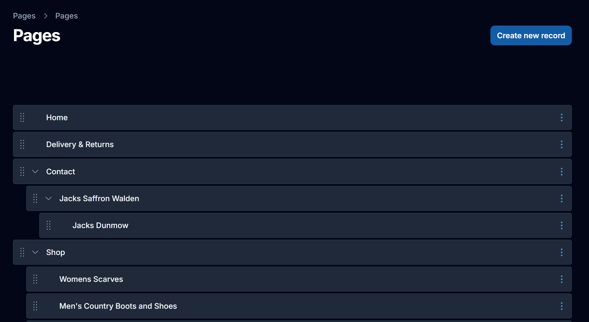

# Filament Nested Sortable Plugin

A Filament Panels plugin for ordering and nesting model records.



## Installation

You can install the package via composer:

```bash
composer require johncarter/filament-nested-sortable
```

## Usage

Ensure your model has an `order` integer column and an integer `parent_id` with a **default to `-1`**.

### 1. Create a new page in your resource
e.g. `app/Filament/Resources/PageResource/Pages/TreeListPages.php`

Make sure the page extends `JohnCarter\FilamentNestedSortable\Pages\NestedSortablePage`.

```php
use JohnCarter\FilamentNestedSortable\Pages\NestedSortablePage;

class TreeListPages extends NestedSortablePage
{
    // ...
}
```

### 2. Add the page to your main PageResource Page
```php
public static function getPages(): array
{
    return [
        'index' => Pages\TreeListPages::route('/'),
    ];
}
```

### 3. Add plugins Tailwind CSS class content
Add the plugin's view paths to your `resources/css/filament/cp/theme.css` file:

```css
@import '/vendor/johncarter/filament-nested-sortable/resources/views/**/*.blade.php';
```

### 4. Modify the create record form:

```php
public function getCreateRecordFormSchema(): array
    {
        return [
            TextInput::make('title')
                ->reactive()
                ->afterStateUpdated(
                    fn($state, callable $set) =>
                    $set('slug', Str::slug($state))
                ),

            TextInput::make('slug')
                ->extraAttributes(['class' => 'font-mono text-gray-500']),
        ];
    }
```

### 5. Add actions to the record action group
```php

    public function getRecordActions(): array
    {
        $actions = parent::getRecordActions();

        array_unshift($actions, $this->viewAction());

        return $actions;
    }

    public function viewAction(): Action
    {
        return Action::make('view')
            ->icon('heroicon-o-eye')
            ->openUrlInNewTab()
            ->url(function (array $arguments) {
                return $arguments['record']['url'];
            });
    }
```
